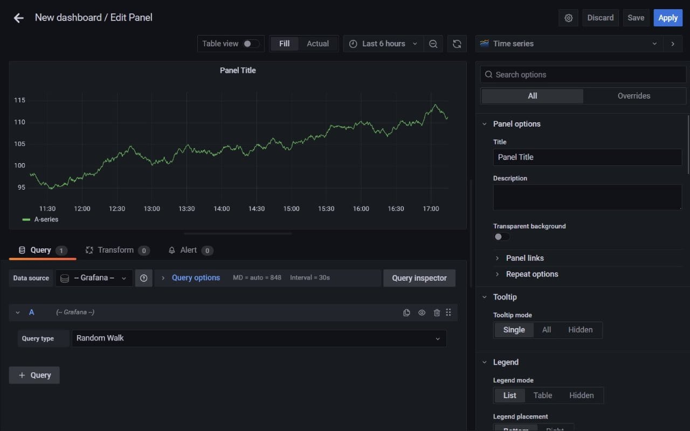

# Grafana CI/CD pipeline

Deploy Grafana server with CI/CD on Elestio

 
 

# Once deployed ...

You can open Grafana UI here:

    URL: https://[CI_CD_DOMAIN]
    email: root
    password: [ADMIN_PASSWORD]
